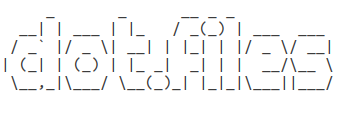

[](https://github.com/ansible/ansible)
[](https://github.com/tinoschroeter/dotfiles/actions/workflows/linter.yml)


# Install Nodebook :computer:
```shell
  git clone https://github.com/tinoschroeter/dotfiles.git \
  && cd dotfiles \
  && ./setup
```
## Ansible Tree
```shell
.
├── ansible.cfg
├── inventory
├── roles
│   ├── dotfiles
│   │   └── tasks
│   │       └── main.yaml
│   ├── folder
│   │   └── tasks
│   │       └── main.yaml
│   ├── npm
│   │   └── tasks
│   │       └── npm.yaml
│   ├── software
│   │   └── tasks
│   │       └── main.yaml
│   ├── system
│   │   └── tasks
│   │       └── main.yaml
│   ├── vim
│   │   └── tasks
│   │       └── main.yaml
│   ├── vm
│   │   └── tasks
│   │       └── main.yaml
│   └── zsh
│       └── tasks
│           └── main.yaml
└── site.yaml

```

## Roles

<details>
  <summary>folder</summary>

  * Setup [roles/folder/tasks/main.yaml](https://github.com/tinoschroeter/dotfiles/blob/master/playbook/roles/folder/tasks/main.yaml)
    * create folter structure

</details>

<details>
  <summary>software</summary>
  
  * Setup [roles/software/tasks/main.yaml](https://github.com/tinoschroeter/dotfiles/blob/master/playbook/roles/software/tasks/main.yaml)
    * install docker
    * Install utility packages
    * Install aws cli
    * Install skaffold
    * Install kubectl
    * Install nvm (Node.js Version Manager)
    * Install Slack

</details>

<details>
  <summary>system</summary>

  * Setup [roles/system/tasks/main.yaml](https://github.com/tinoschroeter/dotfiles/blob/master/playbook/roles/system/tasks/main.yaml)
    * Set timezone to Europe/Berlin

</details>

<details>
  <summary>zsh</summary>

  * Setup [roles/zsh/tasks/main.yaml](https://github.com/tinoschroeter/dotfiles/blob/master/playbook/roles/zsh/tasks/main.yaml)
    * Install zsh
    * Install Oh My Zsh
    * setup some plugins

</details>

<details>
  <summary>vim</summary>

  * Setup [roles/vim/tasks/main.yaml](https://github.com/tinoschroeter/dotfiles/blob/master/playbook/roles/vim/tasks/main.yaml)
    * Install vim 
    * Setup vim plugins

</details>

<details>
  <summary>dotfiles</summary>

  * Setup [roles/dotfiles/tasks/main.yaml](https://github.com/tinoschroeter/dotfiles/blob/master/playbook/roles/dotfiles/tasks/main.yaml)
    * put .zshrc in place
    * put .vimrc in place

</details>

<details>
  <summary>npm</summary>

  * Setup [roles/npm/tasks/main.yaml](https://github.com/tinoschroeter/dotfiles/blob/master/playbook/roles/npm/tasks/main.yaml)
    * install global npm packages

</details>

<details>
  <summary>vm</summary>

  * Setup [roles/vm/tasks/main.yaml](https://github.com/tinoschroeter/dotfiles/blob/master/playbook/roles/vm/tasks/main.yaml)
    * Install virtualbox
    * Install vagrant

</details>
